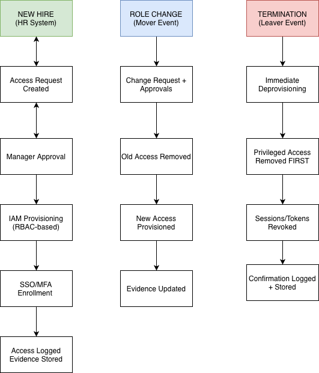

# IAM/GRC Analyst Portfolio
### Kender Saint-Juste · Tampa, FL · [career.usejuste.com](https://career.usejuste.com)

**B.S. Information Science, Information Security Concentration** · University of South Florida '23 · 3.76 GPA
**Certifications:** CompTIA Security+ SY0-701 *(In Progress · Target: Sept 2026)* · SC-300 *(Planned)*

> Targeting: **GRC Analyst · IT Compliance Analyst · Information Security Analyst · Solutions Engineer**
> Specialization: Identity & Access Governance · Governance, Risk & Compliance · Security Policy Development · Audit Readiness

---

## ⚡ Live Product — Least by Juste™

**I didn't just study access reviews. I built a product that automates them.**

[Least by Juste™](https://app.getleast.io) is a live SaaS product I founded and built as CEO of Juste™ LLC — an access review automation tool for Google Workspace that generates SOC 2-aligned audit evidence for SMBs. It connects to Google Admin SDK via OAuth 2.0, ingests user/group/role data, runs a risk engine against SOC 2 CC6.x controls, and produces structured audit evidence.

Every artifact in this portfolio reflects the governance frameworks and IAM controls that Least by Juste™ automates in production. This is not academic work — it's operational knowledge translated into a live product.

**Stack:** Next.js · Python · FastAPI · Supabase · Google Admin SDK · OAuth 2.0 · Cron automation · SOC 2 CC6.x audit evidence generation

---

## Portfolio at a Glance

| Artifact | Type | Frameworks |
|---|---|---|
| [BYOD & Password Security Policy](./policy-documents/byod-password-security-policy.md) | Policy Document | NIST CSF 2.0 · HIPAA · FIPA · NIST SP 800-63B |
| [NIST CSF 2.0 → SOC 2 Control Crosswalk](./framework-mapping/nist-csf-soc2-crosswalk.md) | Framework Mapping | NIST CSF 2.0 · SOC 2 TSC · Gap Analysis |
| [RBAC & Quarterly Access Review Framework](./access-reviews-rbac/) | Access Governance | SOC 2 CC6 · ISO 27001 · Least Privilege |
| [Joiner–Mover–Leaver (JML) Lifecycle Controls](./jml-lifecycle-controls/) | Identity Lifecycle | SOC 2 · ISO 27001 · NIST CSF |
| [SSO / MFA Rollout Runbook](./sso-mfa-runbook/) | Implementation Runbook | SAML · OAuth · MFA Governance · Audit Evidence |
| [Audit Evidence Reference](./audit-evidence/) | Audit Preparation | SOC 2 · ISO 27001 · Evidence Collection |

---

## Framework Coverage

| Framework | Depth | Where Applied |
|---|---|---|
| NIST CSF 2.0 | All 6 Functions (Govern → Recover) | Policy document · Framework crosswalk |
| SOC 2 Trust Services Criteria | CC1–CC9 · Gap analysis | Crosswalk · RBAC · Access reviews · Audit evidence |
| ISO 27001 | Annex A · A.5.15–A.5.18 IAM controls | JML lifecycle · SSO/MFA runbook |
| NIST SP 800-63B | Password & authentication standards | BYOD policy · MFA enforcement |
| CIS Controls v8 | Controls 5 & 6 (Account/Access Mgmt) | RBAC framework |
| HIPAA Security Rule | Access controls · Audit controls | BYOD policy · Evidence framework |
| FIPA (Florida) | Data protection · Breach notification | BYOD policy |

---

## GRC Artifacts

### 1. BYOD & Password Security Policy
📁 [`policy-documents/`](./policy-documents/)

Full cybersecurity policy written to a professional services organization environment. Identifies four risk conditions (V-01 through V-04), maps each to NIST CSF 2.0 controls, and documents regulatory compliance obligations across Florida Bar Rule 1.6(c), FIPA, HIPAA, and NIST SP 800-63B. Includes roles & responsibilities table, enforcement provisions, and audit evidence collection guidance mapped to SOC 2 CC6.1, CC6.2, CC6.3, and CC6.7.

**Control areas covered:** BYOD governance · MDM enrollment & remote wipe · Password complexity (NIST SP 800-63B aligned) · MFA enforcement · Account lifecycle management & least privilege · RBAC · Quarterly access reviews · 24-hour deprovisioning SLA

---

### 2. NIST CSF 2.0 → SOC 2 Control Crosswalk
📁 [`framework-mapping/`](./framework-mapping/)

Practitioner-level control mapping across all six NIST CSF 2.0 functions to SOC 2 Trust Services Criteria. Includes a coverage gap analysis identifying five SOC 2 criteria with no direct NIST CSF equivalent (CC8.1 Change Management, PI1.x Processing Integrity, P-series Privacy, A1.1 Capacity Planning), and an evidence mapping table showing which single evidence artifact satisfies multiple framework requirements simultaneously.

**Use cases:** Dual-framework compliance programs · Audit preparation · Gap assessments · Evidence package design

---

## IAM / Identity Governance Artifacts

### 3. Access Reviews & RBAC Framework
📁 [`access-reviews-rbac/`](./access-reviews-rbac/)

Audit-ready quarterly access review process with RBAC role-permission matrix (filled example: Acme Health Services), exception handling workflow, and evidence retention guidance. Templates mapped to SOC 2 CC6.3 compliance evidence requirements.

> **In production:** Least by Juste™ automates this exact workflow for Google Workspace environments — connecting to Google Admin SDK, ingesting user/group/role data, and generating structured SOC 2 CC6.x audit evidence automatically.

---

### 4. Joiner–Mover–Leaver (JML) Lifecycle Controls
📁 [`jml-lifecycle-controls/`](./jml-lifecycle-controls/)

Standardized identity lifecycle controls for Joiner, Mover, and Leaver events. Includes workflow diagrams, SLA targets, approval chains, and evidence checklists. Designed for environments using Okta, Entra ID, or any IGA platform.

*Joiner → Mover → Leaver governance flow with approval checkpoints and audit evidence retention.*

---

### 5. SSO / MFA Rollout Runbook
📁 [`sso-mfa-runbook/`](./sso-mfa-runbook/)

Four-phase SSO and MFA implementation playbook covering risk assessment, pilot deployment, phased rollout, and full enforcement. Includes break-glass access handling, exception management, and audit evidence collection aligned to SOC 2 and ISO 27001.

---

### 6. Audit Evidence Reference
📁 [`audit-evidence/`](./audit-evidence/)

Sample evidence index showing what to collect, where it comes from, and what it proves — organized by control type (access reviews, JML, MFA, privileged access, logging). Includes a completed quarterly access review example (Zendesk, Q4 2025) with real findings, remediation tickets, and attestation.

---

## Templates
📁 [`templates/`](./templates/)

Reusable governance templates:
- RBAC Role–Permission Matrix (blank + filled example)
- Quarterly Access Review Checklist
- JML Evidence Checklist
- Sample completed access review (Zendesk Q4 2025)

---

## How This Maps to Real GRC Work

The controls, evidence patterns, and framework mappings in this portfolio reflect how GRC programs operate in environments subject to SOC 2, ISO 27001, and NIST CSF audits:

- **Policy → Control → Evidence** is the chain that satisfies auditors. Every artifact here follows that chain.
- **Dual-framework mapping** (NIST CSF + SOC 2) reduces redundant compliance work — one evidence artifact satisfies both frameworks where mappings exist.
- **Access governance** (RBAC, JML, access reviews) directly addresses SOC 2 CC6 — the most commonly tested control category in Type II audits.
- **Gap analysis** in the crosswalk reflects the kind of assessment a GRC Analyst performs when an organization wants to pursue SOC 2 attestation alongside an existing NIST-aligned security program.
- **Least by Juste™** demonstrates that this governance knowledge is operational, not theoretical — it's been translated into a live product that automates the access review workflow end-to-end.

---

## Background

12+ years of professional experience spanning enterprise SaaS sales and technical support (TeamViewer — SDR → ISR → Customer Support Specialist), identity and access governance, and hands-on product development. At TeamViewer, worked daily with SSO/SAML configurations, Conditional Access policies, MFA enforcement, 2FA troubleshooting, and compliance-adjacent enterprise customer environments — the same controls documented in this portfolio.

Founded Juste™ LLC in March 2026. Currently pursuing GRC Analyst, Information Security Analyst, and Solutions Engineer roles while building Least by Juste™ to its first paying customers.

---

## Tools & Platforms

`Microsoft Entra ID` `Google Admin SDK` `Okta` `Vanta` `Drata` `Microsoft Purview` `ServiceNow GRC` `Jira` `Zendesk` `Salesforce` `SAML/OAuth 2.0` `SIEM concepts` `Python` `Next.js` `Supabase`

---

## Contact

**Portfolio:** [career.usejuste.com](https://career.usejuste.com)
**Live Product:** [app.getleast.io](https://app.getleast.io)
**LinkedIn:** [linkedin.com/in/kendersaintjuste](https://www.linkedin.com/in/kendersaintjuste)
**GitHub:** [github.com/KsaintJ](https://github.com/KsaintJ)
**Email:** ksaintjuste7@gmail.com
**Location:** Tampa, FL · Remote-First · Hybrid Available

---

*IAM/GRC Analyst Portfolio · Kender Saint-Juste · Tampa, FL · Updated July 2026*
